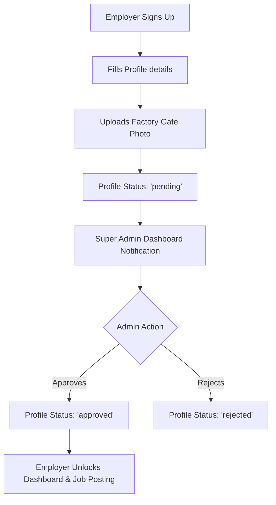
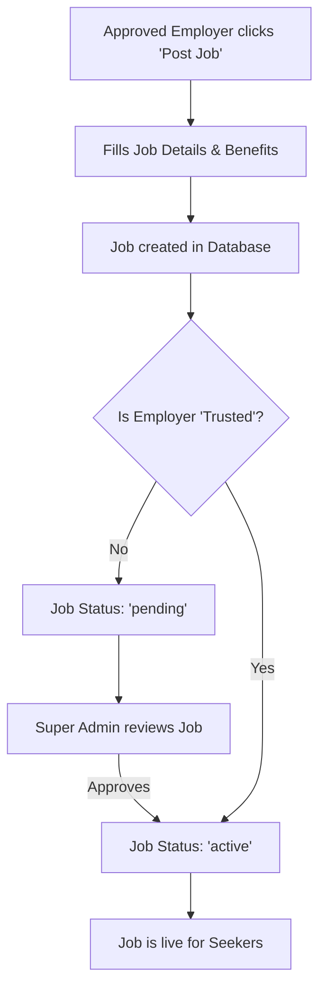
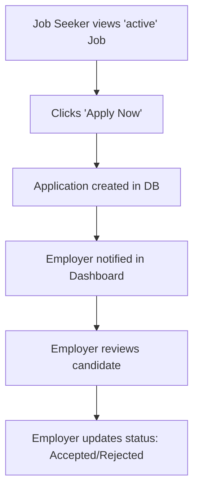

# NexPride - Full Project Documentation

**NexPride** is India’s premier inclusive job platform specifically designed to connect the LGBTQ+ and Transgender community with verified, inclusive workplaces. The platform emphasizes trust, safety, and a seamless user experience.

---

## 🛠️ Technology Stack
- **Frontend Framework**: Next.js (React 18, App Router)
- **Styling**: Tailwind CSS, CSS Modules, Claymorphism Design System
- **UI Components**: Radix UI primitives, Lucide React (Icons)
- **Backend & Database**: Firebase (Firestore, Authentication, Cloud Storage via Base64 encoding)
- **State Management**: React Hooks (useState, useEffect, useMemo), Context API (LanguageProvider, FirebaseClientProvider)
- **Language**: TypeScript

---

## 👥 User Roles & Capabilities

The platform operates on a strict Role-Based Access Control (RBAC) system with three primary roles:

### 1. Job Seeker
- **Onboarding**: Simple signup process using email/password or Google Auth.
- **Profile Building**: Seekers can add their basic details, experience, preferred job categories (Staff or Worker), and location.
- **Job Discovery**: Seekers can browse jobs, filter by department/designation, and search based on location.
- **Applications**: One-click application process. Seekers can track the status of their applications (Pending, Reviewed, Accepted, Rejected).
- **Safety**: Seekers have access to a "Trust & Safety Hub" providing guidelines on safe interviews and protecting personal data.

### 2. Employer (Factory/Company)
- **Onboarding**: Employers must undergo a strict verification process.
- **Profile Verification**: To gain access, employers must provide their GST Number, business location, and upload a **Factory Gate Photo** (which is automatically compressed and converted to Base64 using HTML5 Canvas before uploading to Firestore).
- **Dashboard Access**: Upon registration, employers are locked in a "Pending" state and cannot access the main dashboard or post jobs until a Super Admin approves them.
- **Job Posting**: Once approved, employers can post jobs. They must specify details like salary, benefits (ESI, EPF, Food, etc.), and shift timings.
- **Candidate Management**: Employers can view applications for their jobs and update candidate statuses.

### 3. Super Admin
- **Global Dashboard**: A comprehensive control panel to monitor platform activity.
- **Employer Approval**: Admins review incoming factory registrations (verifying GST and photos) and can Approve or Reject them.
- **Job Approval**: By default, when an employer posts a job, it goes into a "Pending" state. The Super Admin must review and approve the job before it becomes visible to Job Seekers.
- **Master Data Management**: Admins can manage dynamic dropdown data, such as Job Categories, Departments, and Designations.

---

## 🔄 Core Workflows

### Workflow 1: Employer Verification Flow

### Workflow 2: Job Posting & Moderation Flow

### Workflow 3: Job Application Flow

---

## 🏗️ Architectural Highlights

1. **Global Footer & Layout Cleanup**
   - The application utilizes a global `<NavigationCleanup />` component in the root layout to handle Radix UI `pointer-events` bugs during Next.js route transitions.
   - A universal `<Footer />` is securely docked at the bottom of the layout, ensuring it appears symmetrically across all screens, utilizing CSS `flex-1` logic.

2. **Image Processing**
   - Instead of immediately relying on complex cloud storage buckets, the platform utilizes client-side HTML5 `<canvas>` elements to scale, compress, and convert user-uploaded images (like factory gates) into highly optimized `Base64` strings before saving them directly into Firestore documents.

3. **Claymorphism Aesthetic**
   - The UI heavily relies on a custom "Clay" aesthetic (`clay-card`, `clay-btn`), characterized by soft, inset shadows, pastel violet gradients, and rounded edges, making the platform feel approachable, modern, and highly premium.

4. **Scroll & Overflow Management**
   - Complex Radix UI dialogs containing flexible content use constrained `max-h-[85vh]` parameters paired with `min-h-0` flex boundaries to ensure long content (like Trust & Safety guidelines) natively scrolls on mobile devices without breaking the flexbox layout.

---

## 🚀 Upcoming Features
- **Trusted Employer Bypass**: Allowing Super Admins to toggle a `trustedEmployer` flag on specific factories so their job posts bypass the manual approval queue and go live instantly.
- **Multilingual Support**: Fully translating the platform into regional languages using the integrated `LanguageProvider`.
